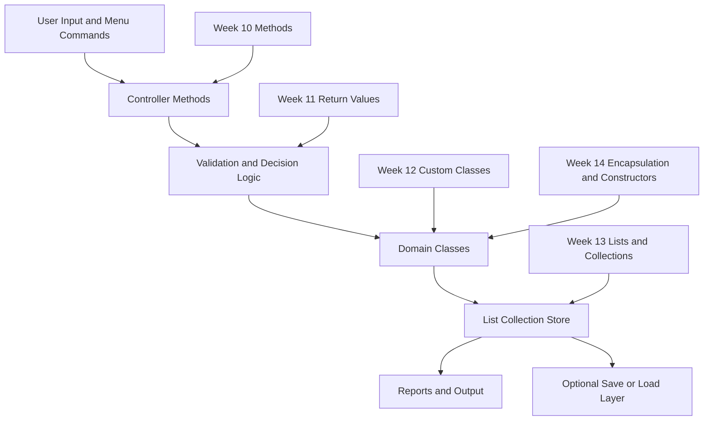
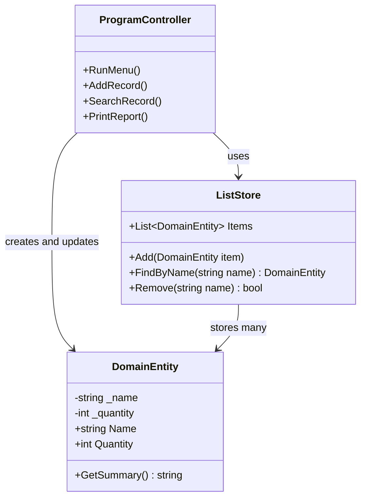
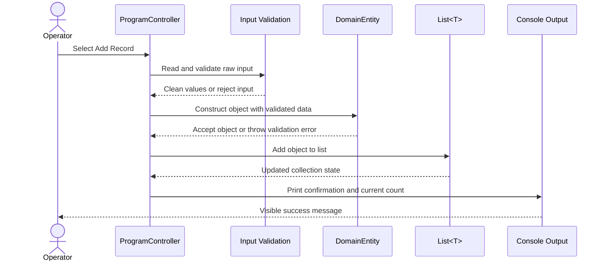
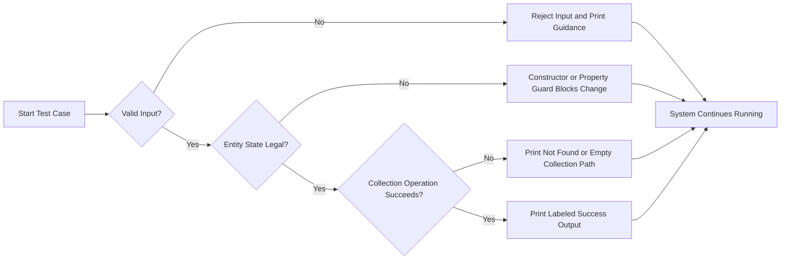

# Week 15 Architecture Diagrams

These Mermaid drafts are intended to help students visualize how Weeks 10-14 become one integrated capstone system in Week 15.

## 1. Global System Architecture

## 2. Class and Responsibility Map

## 3. Add-Record Sequence Flow

## 4. Verification and Failure-Boundary Map

## Suggested Use

- Use Diagram 1 in the Week 15 overview or slide deck.
- Use Diagram 2 while explaining class boundaries and list ownership.
- Use Diagram 3 when demonstrating one full operator workflow live.
- Use Diagram 4 as the testing and grading checklist visual.